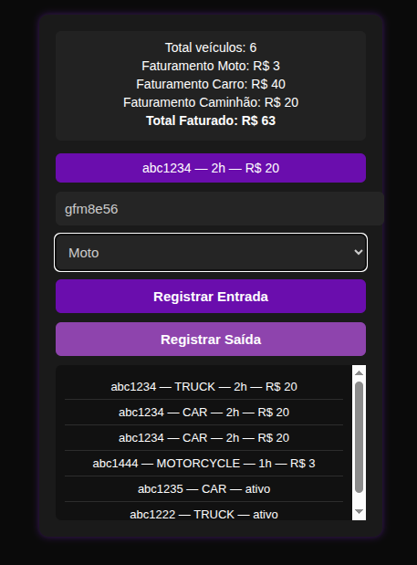
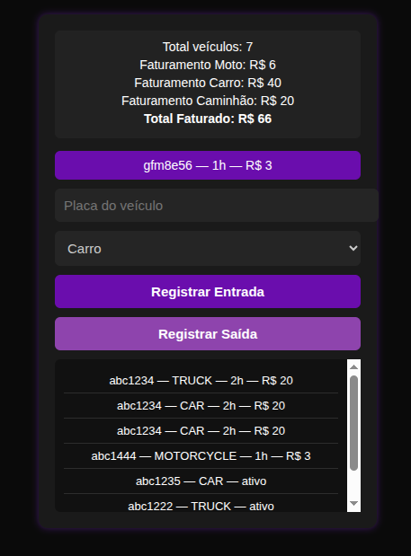

## Controle de Estacionamento Inteligente

Sistema web simples para registrar entrada, saída e gerar relatórios de um estacionamento.
A cobrança é feita por hora, arredondando sempre para cima, e os preços vêm diretamente de classes por tipo de veículo:

Veículo	Valor / hora
Moto	R$ 3
Carro	R$ 5
Caminhão	R$ 10

## Objetivo do projeto

Automatizar o cálculo de uso do estacionamento e fornecer:

✅ Registro de entrada de veículos pela placa
✅ Registro de saída + cálculo de horas e valor total
✅ Relatórios completos com:
  • Quantidade de veículos por tipo
  • Total de horas estacionadas
  • Faturamento por categoria
  • Faturamento geral

O sistema usa Composer para autoload e SQLite como banco.

📁 Estrutura de pastas
```
    /Controle-de-Estacionamento-Inteligente
    │── /public
    │    │── index.php
    │    │── entry.php
    │    │── exit.php
    │    │── report.php
    │── /src
    │    │── /Application
    │    │      │── ParkingService.php
    │    │── /Domain
    │    │      │── Parking.php
    │    │      │── ParkingValidator.php
    │    │      │── ParkingCalculator.php
    │    │      │── ParkingRepository.php (interface)
    │    │── /Domain/VehicleHourPrice
    │    │      │── CarPrice.php
    │    │      │── MotorcyclePrice.php
    │    │      │── TruckPrice.php
    │    │      │── IPrice.php (interface)
    │── /storage
    │    │── database.sqlite
    │── /vendor (gerado pelo composer)
    │── composer.json
    │── migrate.php
```

## Comandos para rodar o projeto
1º Instalar dependências do Composer
```composer install```

2º Criar/Recriar a tabela do banco SQLite
```php migrate.php```

3º Acessar no navegador
localhost/Controle-de-Estacionamento-Inteligente/public/index.php

## Como funciona

A UI envia a placa e o tipo de veículo

A ParkingService orquestra a operação

A ParkingCalculator calcula horas e preço total

O Repository salva no SQLite

O relatório soma apenas veículos que já tem preço calculado no banco

## Resultado esperado

# Registro de Entrada:


# Registro de Saída:


Relatório principal mostra:
Total veículos: 6 - 7
Faturamento Moto: R$ 3 - 6
Faturamento Carro: R$ 40
Faturamento Caminhão: R$ 20
Total Faturado: R$ 63~66

Saída exibe:
abc1234 — 2h — R$ 10
abc1234 — 2h — R$ 20


(ativo aparece apenas como — ativo, sem horas nem valor)